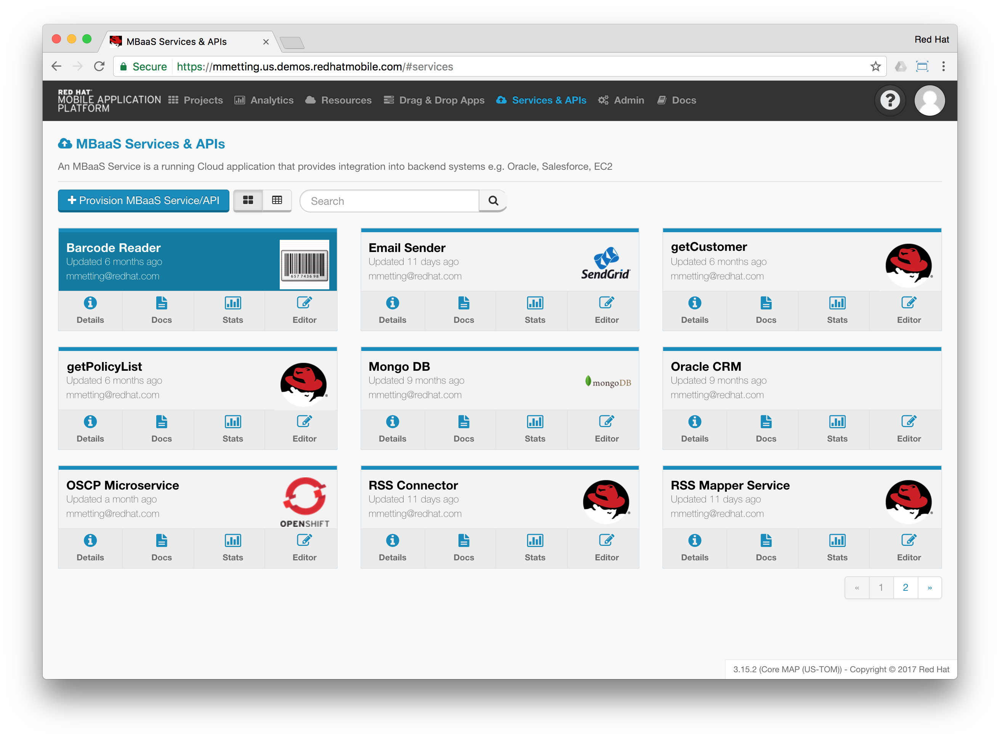

# RSS Connector Service

Connects to the RSS feed of [opensource.com](https://opensource.com/).

RSS feeds are usually provided in an XML format. Though XML has a slight overhead compared to a JSON response. Especially if bandwith
plays an important role (re Mobile).

Therefore this MBaaS Service uses a Node module `rss-parser` to call out to [opensource.com](https://opensource.com/), retrieving the feed 
as XML and converting it to JSON.

## Import an existing MBaaS Service to your domain

- Click on `MBaaS Services & APIs`
- Select `Provision a new MBaaS Service/API`


- Choose the `New mBaaS Service` template
- Name your new Service: `RSS Connector`


- Click on `Next`
- Wait for the service to Provision
- Click `Finish`, you'll be directed to the details screen of your new service.


- Clone `this` Git-Repository locally:

```
mmetting-OSX:tmp mmetting$ git clone https://github.com/mmetting/RSS-Reader-Demo-RSS-Connector.git
Cloning into 'RSS-Reader-Demo-RSS-Connector'...
remote: Counting objects: 147, done.
remote: Compressing objects: 100% (52/52), done.
remote: Total 147 (delta 63), reused 147 (delta 63), pack-reused 0
Receiving objects: 100% (147/147), 19.34 KiB | 0 bytes/s, done.
Resolving deltas: 100% (63/63), done.
```

- `cd` into the cloned repo
- Add a new remote to the local clone. The URL for the new remote is the Git-URL of the above created MBaaS Service and can be found in the MBaaS Service's details tab.

```
mmetting-OSX:RSS-Reader-Demo-RSS-Connector mmetting$ git remote add rhmap git@git.tom.redhatmobile.com:mmetting/RSS-Connector-RSS-Connector.git
```

- Check if the new remote was added

```
mmetting-OSX:RSS-Reader-Demo-RSS-Connector mmetting$ git remote -v
origin	https://github.com/mmetting/RSS-Reader-Demo-RSS-Connector.git (fetch)
origin	https://github.com/mmetting/RSS-Reader-Demo-RSS-Connector.git (push)
rhmap	git@git.tom.redhatmobile.com:mmetting/RSS-Connector-RSS-Connector.git (fetch)
rhmap	git@git.tom.redhatmobile.com:mmetting/RSS-Connector-RSS-Connector.git (push)
```

- Overwrite the remote repository setting in RHMAP with the local clone:

```
mmetting-OSX:RSS-Reader-Demo-RSS-Connector mmetting$ git push -u rhmap -f
##########################################################################
# THIS SYSTEM IS RESTRICTED TO AUTHORIZED USERS FOR AUTHORIZED USE ONLY. #
# UNAUTHORIZED ACCESS IS STRICTLY PROHIBITED AND MAY BE PUNISHABLE UNDER #
# THE COMPUTER FRAUD AND ABUSE ACT OF 1986 OR OTHER APPLICABLE LAWS.     #
# IF NOT AUTHORIZED TO ACCESS THIS SYSTEM, DISCONNECT NOW.               #
# BY CONTINUING, YOU CONSENT TO YOUR KEYSTROKES AND DATA CONTENT BEING   #
# MONITORED. ALL PERSONS ARE HEREBY NOTIFIED THAT THE USE OF THIS SYSTEM #
# CONSTITUTES CONSENT TO MONITORING AND AUDITING.                        #
##########################################################################
Enter passphrase for key '/Users/mmetting/.ssh/id_rsa_rhmap': 
Counting objects: 147, done.
Delta compression using up to 8 threads.
Compressing objects: 100% (52/52), done.
Writing objects: 100% (147/147), 19.34 KiB | 0 bytes/s, done.
Total 147 (delta 63), reused 147 (delta 63)
To git.tom.redhatmobile.com:mmetting/RSS-Connector-RSS-Connector.git
 + 8f9d12e...ae84e3b master -> master (forced update)
Branch master set up to track remote branch master from rhmap.
```

- Select the `Deploy` tab in the AppStudio and deploy the MBaaS service:


## Test the MBaaS Service
You should now also be able to test this MBaaS Service:

- Click on the `Docs` tab
- Click on `Try it` to call out for RSS feeds


## Add a deployed service to your project

- Change the access rights of the MBaaS Service to reflect the project, you want to use the connector in:


- Click `Save`
- You will be asked to re-deploy the service. Click on `Deploy` to do so.
- Continue with importing the [Mapping Service](https://github.com/mmetting/RSS-Reader-Demo-Mapper-Service).

# Group Feeds API
This part of the README.md makes the MBaaS Service testable from RHMAP's App Studio. Please ignore, since the formatting is optimized for RHMAP.

# feeds [/feeds]

'Feeds' endpoint.

## feeds [GET] 

'Feeds' endpoint.

+ Request (application/json)

+ Response 200 (application/json)

+ Body